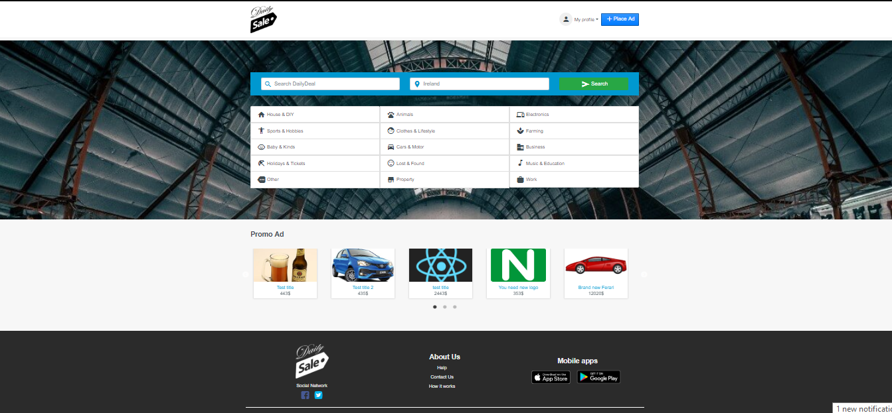

# MEAN Stack dailySale 


# Stack of technologies


```sh
$ git clone git@github.com:yaroslav0507/FullStackJS.git # or clone your own fork
$ cd dailySale
$ cd server
$ npm install
$ npm start
$ cd client
$ npm install
$ npm start
```
# Running of project

Make sure you have Node.js installed.

$ git clone https://github.com/EmilGeorgievIT/dailySale.git # or clone your own fork
$ cd dailySale
$ cd server
$ npm install
$ npm start
$ cd client
$ npm install
$ npm start

# Interface

Home

