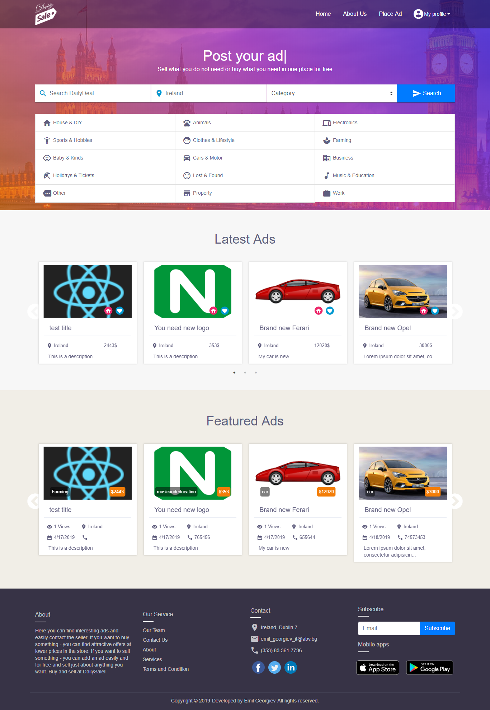

# MEAN Stack dailySale 

# demo

* [dailySale](https://frozen-brushlands-43779.herokuapp.com/);

# Stack of technologies
* [Mongo DB](https://www.mongodb.org/);
* [Express JS](http://expressjs.com/);
* [React JS](https://reactjs.org/);
* [Node JS](https://nodejs.org/);


# Running of project

Make sure you have Node.js installed.

```sh
$ git clone git@github.com:EmilGeorgievIT/dailySale.git # or clone your own fork
$ cd dailySale
$ cd server
$ npm install
$ npm start
$ cd client
$ npm install
$ npm start
```

# Interface

Home

